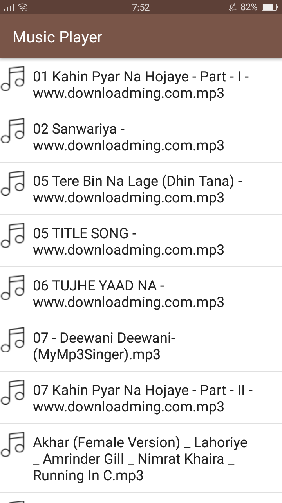
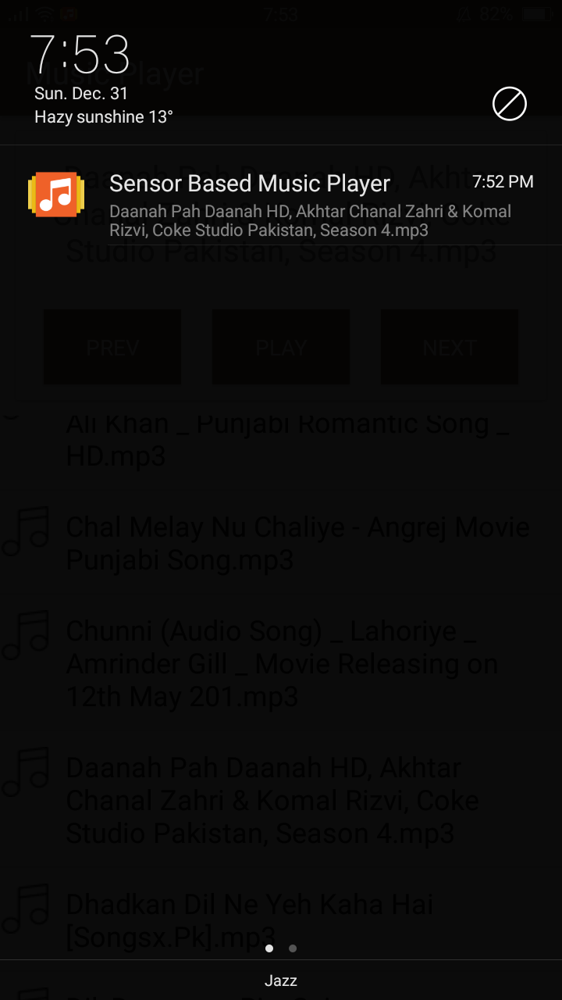
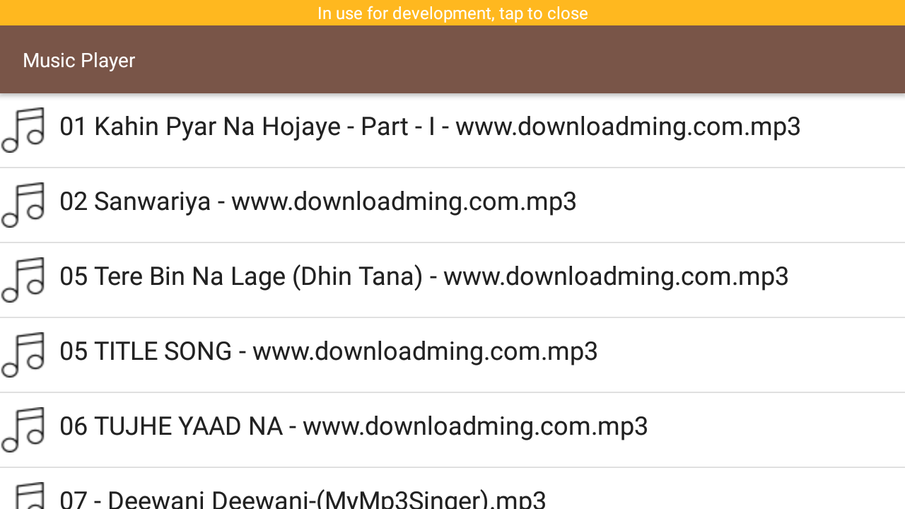

# Sensor-Based-Music-Player

Sensor based Music Player application is an alternative approach of using simple music players app. Just
like normal music player, it can play and pause the media stored in the android device. The idea that
makes this app superior to traditional music player app is the usage of built-in sensors. User can control
music player actions without even unlocking the device by the help of light sensors.

# Some Images

  

  

  

  

  

  

  

  
Last updated: February, 2018
